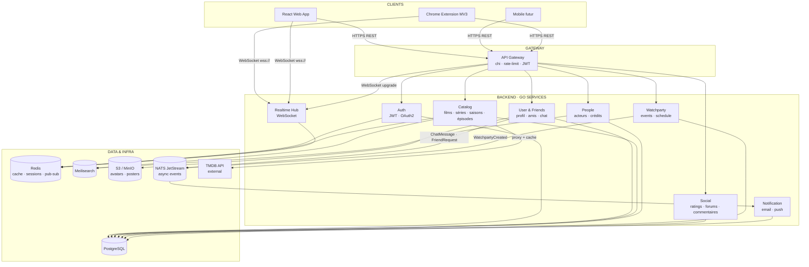
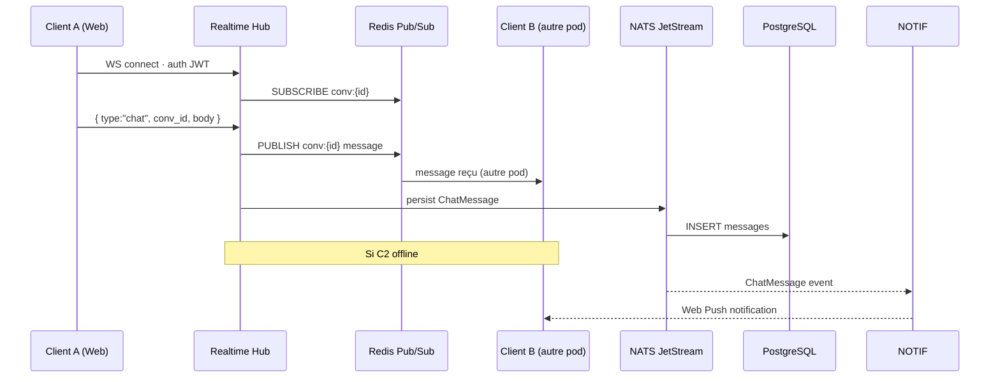
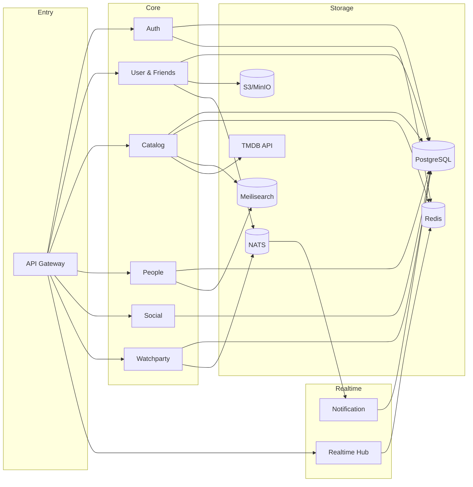
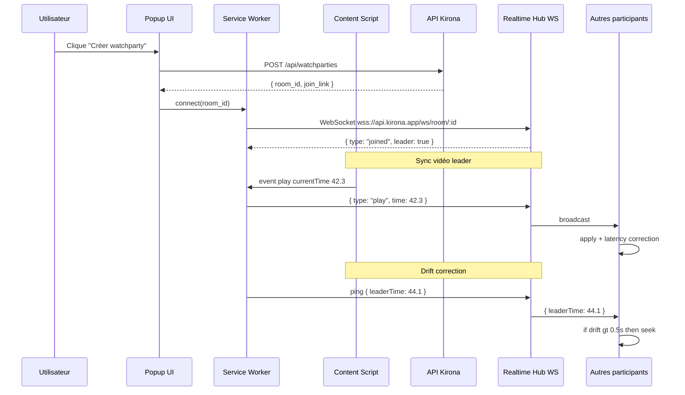
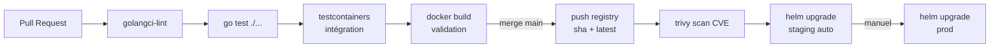
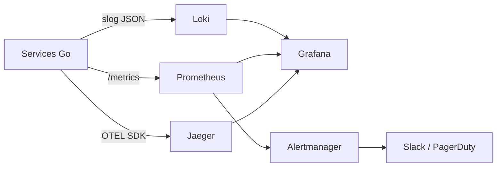

# Kirona — Infrastructure Proposal

> Application communautaire cinéma & séries · Go Backend · React Frontend · Chrome Extension MV3

---

## Table des matières

1. [Vue d'ensemble](#1-vue-densemble)
2. [Services Go](#2-services-go)
3. [Architecture interne d'un service](#3-architecture-interne-dun-service)
4. [Tech Stack](#4-tech-stack)
5. [Extension Chrome MV3](#5-extension-chrome-mv3)
6. [Modèle de données](#6-modèle-de-données)
7. [Déploiement & DevOps](#7-déploiement--devops)
8. [Structure complète du projet](#8-structure-complète-du-projet)

---

## 1. Vue d'ensemble

### Fonctionnalités couvertes

| Domaine | Fonctionnalités |
|---------|----------------|
| **Catalogue** | Films, séries, saisons, épisodes · Catégories · Plateformes disponibles |
| **Personnes** | Acteurs, réalisateurs, producteurs, crédits |
| **Social** | Notations · Commentaires · Forums · Amis · Chat direct temps réel |
| **Watchlist** | Films / séries à voir, en cours, vus |
| **Watchparty** | Planification · Sync vidéo · Chat · Lien d'invitation |
| **Extension** | Chrome MV3 · Netflix · Sync play/pause/seek · Drift correction |
| **Notifications** | Email · Push web · Événements amis / watchparty / chat offline |
| **Calendrier** | Sorties films & séries · Événements watchparty |

---

### Architecture globale



### Chat temps réel — flux WebSocket



### Flux de communication

| Lien | Protocole | Usage |
|------|-----------|-------|
| Client → Gateway | HTTPS REST | Toutes les requêtes applicatives |
| Client → Hub | WebSocket (`wss://`) | Chat DM/groupe + sync watchparty |
| Gateway → Services | HTTP interne | Routing vers les services |
| Services → NATS | Pub/Sub async | Événements métier |
| Services → Redis | TCP | Cache, sessions, Pub/Sub |
| Services → PostgreSQL | TCP (pgx pool) | Données persistantes |

---

## 2. Services Go

### Vue des dépendances



---

## 3. Architecture interne d'un service

### Principe — Layered Architecture

Clean Architecture stricte (Entities / Use Cases / Adapters / Frameworks) est trop verbeuse pour des microservices Go. On adopte une **Layered Architecture pragmatique** à 4 couches avec les mêmes bénéfices :

```
┌─────────────────────────────────────┐
│  handler/        ← HTTP layer       │  Parse req · appelle usecase · écrit resp
├─────────────────────────────────────┤
│  usecase/        ← Business layer   │  Logique métier · orchestration · erreurs
├─────────────────────────────────────┤
│  repository/     ← Data layer       │  SQL (sqlc) · cache Redis · appels externes
├─────────────────────────────────────┤
│  domain/         ← Model layer      │  Structs Go purs · interfaces · constantes
└─────────────────────────────────────┘
```

**Règles :**
- `handler` importe `usecase` uniquement — jamais `repository` directement
- `usecase` importe `repository` via **interface** — jamais les implémentations concrètes
- `domain` n'importe rien du projet — zéro dépendance interne
- `repository` implémente les interfaces définies dans `domain`

### Exemple : service `catalog` — film

```
catalog/internal/
├── domain/
│   ├── film.go          ← struct Film, interface FilmRepository, interface FilmUsecase
│   ├── series.go
│   ├── season.go
│   ├── episode.go
│   ├── category.go
│   └── platform.go
│
├── usecase/
│   ├── film/
│   │   ├── get.go       ← GetFilmByID(ctx, id) — récupère + enrichit avec note moyenne
│   │   ├── list.go      ← ListFilms(ctx, filters) — pagination, filtres
│   │   ├── search.go    ← SearchFilms(ctx, query) — appelle Meilisearch
│   │   └── sync_tmdb.go ← SyncFromTMDB(ctx, tmdbID) — fetch + cache + upsert PG
│   ├── series/
│   │   ├── get.go
│   │   ├── list.go
│   │   └── seasons.go   ← ListSeasons(ctx, seriesID)
│   ├── season/
│   │   ├── get.go
│   │   └── episodes.go  ← ListEpisodes(ctx, seasonID)
│   └── episode/
│       └── get.go
│
├── handler/
│   ├── film/
│   │   ├── routes.go    ← enregistre les routes chi pour films
│   │   ├── get.go       ← GET /films/:id
│   │   ├── list.go      ← GET /films
│   │   └── search.go    ← GET /films/search
│   ├── series/
│   │   ├── routes.go
│   │   ├── get.go
│   │   ├── list.go
│   │   └── seasons.go   ← GET /series/:id/seasons
│   ├── season/
│   │   ├── routes.go
│   │   ├── get.go
│   │   └── episodes.go  ← GET /seasons/:id/episodes
│   ├── episode/
│   │   ├── routes.go
│   │   └── get.go
│   ├── category/
│   │   ├── routes.go
│   │   └── list.go
│   └── platform/
│       ├── routes.go
│       └── list.go
│
├── repository/
│   ├── postgres/
│   │   ├── film.go      ← implémente domain.FilmRepository (sqlc)
│   │   ├── series.go
│   │   ├── season.go
│   │   ├── episode.go
│   │   ├── category.go
│   │   └── platform.go
│   ├── redis/
│   │   └── film_cache.go ← implémente domain.FilmCache
│   └── tmdb/
│       ├── client.go
│       └── film.go      ← implémente domain.TMDBGateway
│
├── db/
│   ├── migrations/
│   └── queries/         ← fichiers .sql source pour sqlc
│
└── cmd/
    └── main.go          ← wire tout + démarre le serveur
```

### Anatomie d'un fichier par couche

**`domain/film.go`** — modèles + interfaces uniquement

```go
package domain

import "time"

type Film struct {
    ID          string
    TMDBId      int
    Title       string
    Year        int
    Synopsis    string
    PosterURL   string
    DurationMin int
    AvgRating   float64
    Categories  []Category
    Platforms   []Platform
    UpdatedAt   time.Time
}

type FilmFilters struct {
    Genre      string
    Year       int
    PlatformID string
    MinRating  float64
    Page       int
    Limit      int
}

// Interfaces — usecase dépend de celles-ci, jamais des implémentations
type FilmRepository interface {
    GetByID(ctx context.Context, id string) (*Film, error)
    List(ctx context.Context, filters FilmFilters) ([]*Film, int, error)
    Upsert(ctx context.Context, film *Film) error
}

type FilmCache interface {
    Get(ctx context.Context, tmdbID int) (*Film, error)
    Set(ctx context.Context, film *Film, ttl time.Duration) error
}

type TMDBGateway interface {
    FetchFilm(ctx context.Context, tmdbID int) (*Film, error)
}
```

**`usecase/film/get.go`** — logique métier pure, testable

```go
package filmusecase

type GetUsecase struct {
    films  domain.FilmRepository
    cache  domain.FilmCache
}

func NewGetUsecase(films domain.FilmRepository, cache domain.FilmCache) *GetUsecase {
    return &GetUsecase{films: films, cache: cache}
}

func (uc *GetUsecase) Execute(ctx context.Context, id string) (*domain.Film, error) {
    film, err := uc.films.GetByID(ctx, id)
    if err != nil {
        return nil, fmt.Errorf("get film: %w", err)
    }
    if film == nil {
        return nil, domain.ErrNotFound
    }
    return film, nil
}
```

**`handler/film/get.go`** — HTTP uniquement, zéro logique métier

```go
package filmhandler

type GetHandler struct {
    uc *filmusecase.GetUsecase
}

func (h *GetHandler) ServeHTTP(w http.ResponseWriter, r *http.Request) {
    id := chi.URLParam(r, "id")
    film, err := h.uc.Execute(r.Context(), id)
    if err != nil {
        render.Error(w, err)  // traduit domain.ErrNotFound → 404
        return
    }
    render.JSON(w, http.StatusOK, film)
}
```

**`handler/film/routes.go`** — enregistrement des routes

```go
package filmhandler

func Mount(r chi.Router, get *GetHandler, list *ListHandler, search *SearchHandler) {
    r.Route("/films", func(r chi.Router) {
        r.Get("/",        list.ServeHTTP)
        r.Get("/search",  search.ServeHTTP)
        r.Get("/{id}",    get.ServeHTTP)
    })
}
```

**`cmd/main.go`** — wiring, injection de dépendances

```go
// Infra
pool    := postgres.NewPool(cfg.DatabaseURL)
rdb     := redis.NewClient(cfg.RedisURL)
meili   := meilisearch.NewClient(cfg.MeiliURL, cfg.MeiliKey)
tmdbCli := tmdb.NewClient(cfg.TMDBKey)

// Repositories
filmRepo  := pgrepository.NewFilmRepository(pool)
filmCache := redisrepository.NewFilmCache(rdb)
tmdbGW    := tmdbrepository.NewFilmGateway(tmdbCli)

// Usecases
getFilm   := filmusecase.NewGetUsecase(filmRepo, filmCache)
listFilms := filmusecase.NewListUsecase(filmRepo, meili)
syncTMDB  := filmusecase.NewSyncUsecase(filmRepo, filmCache, tmdbGW)

// Handlers
filmGet    := filmhandler.NewGetHandler(getFilm)
filmList   := filmhandler.NewListHandler(listFilms)

// Router
r := chi.NewRouter()
r.Use(middleware.Logger, middleware.Auth)
filmhandler.Mount(r, filmGet, filmList, ...)

http.ListenAndServe(cfg.Port, r)
```

### Règles à respecter dans tous les services

| Règle | Détail |
|-------|--------|
| 1 fichier = 1 responsabilité | `get.go`, `list.go`, `create.go` — jamais tout dans `film.go` |
| Interfaces dans `domain` | Le usecase ne connaît que des interfaces |
| Erreurs domaine | `domain.ErrNotFound`, `domain.ErrConflict` — traduits en HTTP dans le handler |
| Pas de `http.Request` dans usecase | Seuls les types domaine traversent la frontière |
| Tests sur usecase | Mocks générés par `mockery` sur les interfaces domain |

---

## 4. Tech Stack

### Backend · Go 1.22+

| Package | Usage | Pourquoi |
|---------|-------|----------|
| `chi` | Router HTTP | Léger, idiomatique, middlewares composables |
| `gorilla/websocket` | WebSocket Hub | Robuste, bas niveau pour contrôle fin |
| `golang-jwt/jwt` | Auth JWT | Standard, RS256 + HS256 |
| `golang.org/x/oauth2` | OAuth2 | Bibliothèque officielle |
| `pgx v5` | Driver PostgreSQL | Le plus rapide, pool de connexions natif |
| `sqlc` | Génération Go depuis SQL | Type-safe, pas de magie ORM |
| `golang-migrate` | Migrations | Versionnées, CI/CD |
| `go-redis v9` | Client Redis | Generics, pipeline, Pub/Sub |
| `meilisearch-go` | Recherche full-text | SDK officiel |
| `nats.go` | Messaging async | NATS JetStream, léger |
| `aws-sdk-go-v2` | S3 / MinIO | Avatars, posters |
| `otel` | Traces | OpenTelemetry → Jaeger |
| `viper` | Config | Env vars, 12-factor |
| `slog` (stdlib) | Logs | JSON structuré, natif Go 1.21+ |
| `mockery` | Mocks | Génère mocks depuis interfaces domain |
| `testify` | Tests | Assertions |
| `testcontainers-go` | Tests intégration | PG/Redis réels dans les tests |

### Frontend · React 19

| Package | Usage |
|---------|-------|
| `Vite 5` | Build, HMR, TypeScript |
| `TanStack Query` | Data fetching + cache client |
| `Zustand` | State global (auth, WS, chat) |
| `React Router v7` | SPA routing |
| `Tailwind CSS v4` | Styling |
| `Framer Motion` | Animations |
| `date-fns` | Calendrier |

### Extension Chrome MV3

| Composant | Technologie |
|-----------|-------------|
| Background | Service Worker (MV3) |
| UI | Preact (léger) |
| Sync vidéo | Content Script + WebSocket |
| Build | Vite + `@crxjs/vite-plugin` |

### Infrastructure

| Service | Outil | Note |
|---------|-------|------|
| Base principale | PostgreSQL 16 | `uuid-ossp`, `pg_trgm` |
| Cache + Pub/Sub | Redis 7 | Sessions, TMDB cache, Hub multi-pod |
| Recherche | Meilisearch | < 1ms |
| Bus événements | NATS JetStream | At-least-once, persisté |
| Stockage objets | MinIO / S3 | Avatars, posters |
| Métriques | Prometheus + Grafana | |
| Logs | Loki | JSON via slog |
| Traces | Jaeger (OTEL) | |
| Alertes | Alertmanager | → Slack / PagerDuty |

---

## 5. Extension Chrome MV3

### Flow de synchronisation



### Permissions Manifest V3

```json
{
  "manifest_version": 3,
  "permissions": ["tabs", "storage", "scripting"],
  "host_permissions": ["*://*.netflix.com/*"],
  "background": { "service_worker": "background/service-worker.js" },
  "content_scripts": [{ "matches": ["*://*.netflix.com/*"], "js": ["content/netflix.js"] }]
}
```

---

## 6. Modèle de données (OLD)

### Schéma entité-relation

```mermaid
erDiagram
    users {
        uuid id PK
        text email
        text username
        text avatar_url
        text bio
        text provider
        timestamptz created_at
    }
    friendships {
        uuid id PK
        uuid requester_id FK
        uuid addressee_id FK
        text status
        timestamptz created_at
    }
    conversations {
        uuid id PK
        text type
        text name
        timestamptz created_at
    }
    conversation_members {
        uuid conversation_id FK
        uuid user_id FK
        timestamptz joined_at
    }
    messages {
        uuid id PK
        uuid conversation_id FK
        uuid sender_id FK
        text body
        timestamptz sent_at
        timestamptz read_at
    }
    categories {
        uuid id PK
        text name
        text slug
        text type
    }
    platforms {
        uuid id PK
        text name
        text slug
        text logo_url
    }
    films {
        uuid id PK
        int tmdb_id
        text title
        int year
        text synopsis
        text poster_url
        int duration_min
        numeric avg_rating
    }
    film_categories { uuid film_id FK
        uuid category_id FK }
    film_platforms { uuid film_id FK
        uuid platform_id FK
        text url }
    series {
        uuid id PK
        int tmdb_id
        text title
        int year_start
        int year_end
        text synopsis
        text poster_url
        text status
        numeric avg_rating
    }
    series_categories { uuid series_id FK
        uuid category_id FK }
    series_platforms { uuid series_id FK
        uuid platform_id FK }
    seasons {
        uuid id PK
        uuid series_id FK
        int number
        text title
        int year
        text poster_url
    }
    episodes {
        uuid id PK
        uuid season_id FK
        int number
        text title
        text synopsis
        int duration_min
        date air_date
        numeric avg_rating
    }
    people {
        uuid id PK
        int tmdb_id
        text name
        text biography
        date birth_date
        text photo_url
        text known_for
    }
    film_credits {
        uuid id PK
        uuid film_id FK
        uuid person_id FK
        text role
        text character_name
        int credit_order
    }
    series_credits {
        uuid id PK
        uuid series_id FK
        uuid person_id FK
        text role
        text character_name
    }
    ratings {
        uuid id PK
        uuid user_id FK
        text target_type
        uuid target_id
        smallint score
        timestamptz created_at
    }
    comments {
        uuid id PK
        uuid user_id FK
        text target_type
        uuid target_id
        text body
        boolean spoiler
        timestamptz created_at
    }
    watchlists {
        uuid user_id FK
        text target_type
        uuid target_id
        text status
        timestamptz added_at
    }
    watchparties {
        uuid id PK
        uuid host_id FK
        text title
        text target_type
        uuid target_id
        timestamptz scheduled_at
        text visibility
        text join_link
    }
    releases {
        uuid id PK
        text target_type
        uuid target_id
        date release_date
        uuid platform_id FK
        text country
    }
    forum_posts {
        uuid id PK
        uuid user_id FK
        text target_type
        uuid target_id
        text title
        text body
        timestamptz created_at
    }

    users ||--o{ friendships : "sends/receives"
    users ||--o{ conversation_members : "joins"
    users ||--o{ messages : "sends"
    conversations ||--o{ conversation_members : "has"
    conversations ||--o{ messages : "contains"
    users ||--o{ ratings : "writes"
    users ||--o{ comments : "writes"
    users ||--o{ watchlists : "has"
    users ||--o{ watchparties : "hosts"
    users ||--o{ forum_posts : "writes"
    films ||--o{ film_categories : "tagged"
    films ||--o{ film_platforms : "available on"
    films ||--o{ film_credits : "has"
    films ||--o{ releases : "has"
    series ||--o{ series_categories : "tagged"
    series ||--o{ series_platforms : "available on"
    series ||--o{ series_credits : "has"
    series ||--o{ seasons : "has"
    seasons ||--o{ episodes : "has"
    people ||--o{ film_credits : "in"
    people ||--o{ series_credits : "in"
    categories ||--o{ film_categories : "groups"
    categories ||--o{ series_categories : "groups"
    platforms ||--o{ film_platforms : "hosts"
    platforms ||--o{ series_platforms : "hosts"
    platforms ||--o{ releases : "on"
```



> `target_type` est un discriminant polymorphique : `'film'`, `'series'`, `'season'`, `'episode'`.
> Cela permet à `ratings`, `comments`, `watchlists`, `watchparties`, `forum_posts` et `releases` de s'appliquer à toute entité du catalogue.

### Redis — clés principales

| Clé | Valeur | TTL |
|-----|--------|-----|
| `session:{user_id}` | refresh token hash | 7 jours |
| `tmdb:film:{id}` | JSON métadonnées | 24h |
| `tmdb:series:{id}` | JSON métadonnées | 24h |
| `tmdb:person:{id}` | JSON biographie | 48h |
| `rate:{ip}` | compteur | 1 min |
| `room:{room_id}:leader` | user_id | durée session |
| `room:{room_id}:members` | SET user_ids | durée session |
| `user:{id}:online` | bool | 30s (heartbeat) |

### Meilisearch — index

| Index | Champs indexés |
|-------|---------------|
| `films` | title, synopsis, director, genres, year |
| `series` | title, synopsis, genres, year_start |
| `episodes` | title, synopsis |
| `people` | name, known_for |
| `users` | username |
| `forum_posts` | title, body |

---

## 7. Déploiement & DevOps

### Pipeline CI/CD



### Dockerfile multi-stage

```dockerfile
FROM golang:1.22-alpine AS builder
WORKDIR /app
COPY go.mod go.sum ./
RUN go mod download
COPY . .
RUN CGO_ENABLED=0 GOOS=linux go build -o service ./cmd/main.go

FROM gcr.io/distroless/static-debian12
COPY --from=builder /app/service /service
ENTRYPOINT ["/service"]
```

### Observabilité



### Sécurité

| Mesure | Détail |
|--------|--------|
| HTTPS partout | TLS via cert-manager (Let's Encrypt) |
| HSTS + CSP | Headers stricts sur le frontend |
| Rate limiting | Par IP et par `user_id` sur la Gateway |
| JWT rotation | Refresh token renouvelé à chaque usage |
| Permissions MV3 | Extension : permissions minimales |
| RGPD | Hébergement EU-West |
| Scan CVE | Trivy dans CI avant deploy prod |

---

## 8. Structure complète du projet

```
kirona/
│
├── go.work                              # Go workspace multi-module
├── go.work.sum
├── Makefile                             # build · test · lint · migrate · sqlc-gen · mock-gen
├── .env.example
├── .gitignore
├── README.md
│
├── ── SERVICES BACKEND (Go) ────────────────────────────────────────────────────
│
├── services/
│   │
│   ├── gateway/                         # API Gateway
│   │   ├── go.mod
│   │   ├── cmd/
│   │   │   └── main.go                  # wire middleware + reverse proxy + start
│   │   ├── internal/
│   │   │   ├── config/
│   │   │   │   └── config.go            # viper: ports, upstream URLs, redis DSN
│   │   │   ├── middleware/
│   │   │   │   ├── auth.go              # validation JWT → injecte user_id dans ctx
│   │   │   │   ├── ratelimit.go         # Redis sliding window par IP + user_id
│   │   │   │   ├── cors.go
│   │   │   │   ├── recover.go           # panic → 500
│   │   │   │   └── logger.go            # slog: method · path · status · latency
│   │   │   └── proxy/
│   │   │       ├── router.go            # chi.Router · monte tous les groupes
│   │   │       └── upstream.go          # httputil.ReverseProxy par service
│   │   └── Dockerfile
│   │
│   ├── auth/                            # Auth Service
│   │   ├── go.mod
│   │   ├── cmd/
│   │   │   └── main.go
│   │   ├── internal/
│   │   │   ├── domain/
│   │   │   │   ├── user.go              # struct User · interface UserRepository
│   │   │   │   └── token.go             # struct Token · interface TokenCache
│   │   │   ├── usecase/
│   │   │   │   ├── register/
│   │   │   │   │   └── register.go      # validate · hash password · insert · emit event
│   │   │   │   ├── login/
│   │   │   │   │   └── login.go         # verify password · issue JWT pair
│   │   │   │   ├── refresh/
│   │   │   │   │   └── refresh.go       # rotate refresh token · issue new access token
│   │   │   │   ├── logout/
│   │   │   │   │   └── logout.go        # revoke refresh token in Redis
│   │   │   │   └── oauth/
│   │   │   │       └── callback.go      # exchange code · upsert user · issue JWT pair
│   │   │   ├── handler/
│   │   │   │   ├── routes.go            # mount /auth/*
│   │   │   │   ├── register.go          # POST /auth/register
│   │   │   │   ├── login.go             # POST /auth/login
│   │   │   │   ├── refresh.go           # POST /auth/refresh
│   │   │   │   ├── logout.go            # POST /auth/logout
│   │   │   │   └── oauth.go             # GET  /auth/oauth/:provider/callback
│   │   │   └── repository/
│   │   │       ├── postgres/
│   │   │       │   └── user.go          # implémente domain.UserRepository (sqlc)
│   │   │       └── redis/
│   │   │           └── token.go         # implémente domain.TokenCache
│   │   ├── db/
│   │   │   ├── migrations/
│   │   │   │   ├── 001_users.up.sql
│   │   │   │   └── 001_users.down.sql
│   │   │   └── queries/
│   │   │       └── user.sql             # sqlc source
│   │   └── Dockerfile
│   │
│   ├── user/                            # User & Friends & Chat Service
│   │   ├── go.mod
│   │   ├── cmd/
│   │   │   └── main.go
│   │   ├── internal/
│   │   │   ├── domain/
│   │   │   │   ├── user.go              # struct User · interface UserRepository
│   │   │   │   ├── friendship.go        # struct Friendship · interface FriendshipRepository
│   │   │   │   ├── conversation.go      # struct Conversation/Member · interfaces
│   │   │   │   └── message.go           # struct Message · interface MessageRepository
│   │   │   ├── usecase/
│   │   │   │   ├── profile/
│   │   │   │   │   ├── get.go           # GetProfile(ctx, id)
│   │   │   │   │   ├── update.go        # UpdateProfile(ctx, id, dto)
│   │   │   │   │   └── avatar.go        # UploadAvatar(ctx, id, file) → S3
│   │   │   │   ├── watchlist/
│   │   │   │   │   ├── list.go
│   │   │   │   │   ├── add.go
│   │   │   │   │   └── remove.go
│   │   │   │   ├── friendship/
│   │   │   │   │   ├── list.go          # ListFriends(ctx, userID)
│   │   │   │   │   ├── request.go       # SendRequest(ctx, from, to) → publish NATS
│   │   │   │   │   ├── accept.go        # AcceptRequest(ctx, id)
│   │   │   │   │   ├── reject.go        # RejectRequest(ctx, id)
│   │   │   │   │   └── remove.go        # RemoveFriend(ctx, userID, friendID)
│   │   │   │   └── chat/
│   │   │   │       ├── list_conversations.go
│   │   │   │       ├── create_dm.go     # crée ou retourne conv DM existante
│   │   │   │       ├── create_group.go
│   │   │   │       ├── get_messages.go  # pagination cursor-based
│   │   │   │       └── persist_message.go # appelé depuis NATS consumer
│   │   │   ├── handler/
│   │   │   │   ├── profile/
│   │   │   │   │   ├── routes.go
│   │   │   │   │   ├── get.go           # GET /users/:id
│   │   │   │   │   ├── update.go        # PUT /users/:id
│   │   │   │   │   └── avatar.go        # POST /users/:id/avatar
│   │   │   │   ├── watchlist/
│   │   │   │   │   ├── routes.go
│   │   │   │   │   ├── list.go          # GET /users/:id/watchlist
│   │   │   │   │   ├── add.go           # POST /users/:id/watchlist
│   │   │   │   │   └── remove.go        # DELETE /users/:id/watchlist/:target
│   │   │   │   ├── friendship/
│   │   │   │   │   ├── routes.go
│   │   │   │   │   ├── list.go          # GET /users/:id/friends
│   │   │   │   │   ├── request.go       # POST /friends/request
│   │   │   │   │   ├── accept.go        # PUT /friends/:id/accept
│   │   │   │   │   ├── reject.go        # PUT /friends/:id/reject
│   │   │   │   │   └── remove.go        # DELETE /friends/:id
│   │   │   │   └── chat/
│   │   │   │       ├── routes.go
│   │   │   │       ├── list.go          # GET /conversations
│   │   │   │       ├── create.go        # POST /conversations
│   │   │   │       └── messages.go      # GET /conversations/:id/messages
│   │   │   ├── events/
│   │   │   │   ├── publisher.go         # NATS publish helpers
│   │   │   │   └── consumer.go          # NATS consume ChatMessage → persist
│   │   │   └── repository/
│   │   │       ├── postgres/
│   │   │       │   ├── user.go
│   │   │       │   ├── friendship.go
│   │   │       │   ├── conversation.go
│   │   │       │   └── message.go
│   │   │       └── s3/
│   │   │           └── avatar.go        # upload + URL présignée
│   │   ├── db/
│   │   │   ├── migrations/
│   │   │   │   ├── 002_friendships.up.sql
│   │   │   │   ├── 003_conversations.up.sql
│   │   │   │   └── 004_messages.up.sql
│   │   │   └── queries/
│   │   │       ├── user.sql
│   │   │       ├── friendship.sql
│   │   │       ├── conversation.sql
│   │   │       └── message.sql
│   │   └── Dockerfile
│   │
│   ├── catalog/                         # Catalog Service
│   │   ├── go.mod
│   │   ├── cmd/
│   │   │   └── main.go
│   │   ├── internal/
│   │   │   ├── domain/
│   │   │   │   ├── film.go              # struct Film · FilmRepository · FilmCache · TMDBGateway
│   │   │   │   ├── series.go
│   │   │   │   ├── season.go
│   │   │   │   ├── episode.go
│   │   │   │   ├── category.go
│   │   │   │   └── platform.go
│   │   │   ├── usecase/
│   │   │   │   ├── film/
│   │   │   │   │   ├── get.go           # GetFilmByID · vérifie cache → PG
│   │   │   │   │   ├── list.go          # ListFilms avec filtres + pagination
│   │   │   │   │   ├── search.go        # SearchFilms → Meilisearch
│   │   │   │   │   └── sync_tmdb.go     # SyncFromTMDB → fetch · upsert · index
│   │   │   │   ├── series/
│   │   │   │   │   ├── get.go
│   │   │   │   │   ├── list.go
│   │   │   │   │   └── seasons.go
│   │   │   │   ├── season/
│   │   │   │   │   ├── get.go
│   │   │   │   │   └── episodes.go
│   │   │   │   ├── episode/
│   │   │   │   │   └── get.go
│   │   │   │   ├── category/
│   │   │   │   │   └── list.go
│   │   │   │   └── platform/
│   │   │   │       └── list.go
│   │   │   ├── handler/
│   │   │   │   ├── film/
│   │   │   │   │   ├── routes.go
│   │   │   │   │   ├── get.go           # GET /films/:id
│   │   │   │   │   ├── list.go          # GET /films?genre=&year=&platform=
│   │   │   │   │   └── search.go        # GET /films/search?q=
│   │   │   │   ├── series/
│   │   │   │   │   ├── routes.go
│   │   │   │   │   ├── get.go           # GET /series/:id
│   │   │   │   │   ├── list.go          # GET /series
│   │   │   │   │   └── seasons.go       # GET /series/:id/seasons
│   │   │   │   ├── season/
│   │   │   │   │   ├── routes.go
│   │   │   │   │   ├── get.go           # GET /seasons/:id
│   │   │   │   │   └── episodes.go      # GET /seasons/:id/episodes
│   │   │   │   ├── episode/
│   │   │   │   │   ├── routes.go
│   │   │   │   │   └── get.go           # GET /episodes/:id
│   │   │   │   ├── category/
│   │   │   │   │   ├── routes.go
│   │   │   │   │   └── list.go          # GET /categories
│   │   │   │   ├── platform/
│   │   │   │   │   ├── routes.go
│   │   │   │   │   └── list.go          # GET /platforms
│   │   │   │   └── search/
│   │   │   │       ├── routes.go
│   │   │   │       └── global.go        # GET /search?q=&type=film|series|episode
│   │   │   └── repository/
│   │   │       ├── postgres/
│   │   │       │   ├── film.go
│   │   │       │   ├── series.go
│   │   │       │   ├── season.go
│   │   │       │   ├── episode.go
│   │   │       │   ├── category.go
│   │   │       │   └── platform.go
│   │   │       ├── redis/
│   │   │       │   └── catalog_cache.go # cache TMDB par type d'entité
│   │   │       ├── meilisearch/
│   │   │       │   └── catalog_index.go # index + search films/séries/épisodes
│   │   │       └── tmdb/
│   │   │           ├── client.go
│   │   │           ├── film.go
│   │   │           ├── series.go
│   │   │           └── mapper.go        # TMDB response → domain structs
│   │   ├── db/
│   │   │   ├── migrations/
│   │   │   │   ├── 005_categories.up.sql
│   │   │   │   ├── 006_platforms.up.sql
│   │   │   │   ├── 007_films.up.sql
│   │   │   │   ├── 008_series.up.sql
│   │   │   │   ├── 009_seasons.up.sql
│   │   │   │   ├── 010_episodes.up.sql
│   │   │   │   ├── 011_film_categories.up.sql
│   │   │   │   ├── 012_film_platforms.up.sql
│   │   │   │   ├── 013_series_categories.up.sql
│   │   │   │   ├── 014_series_platforms.up.sql
│   │   │   │   └── 015_releases.up.sql
│   │   │   └── queries/
│   │   │       ├── film.sql
│   │   │       ├── series.sql
│   │   │       ├── season.sql
│   │   │       ├── episode.sql
│   │   │       ├── category.sql
│   │   │       └── platform.sql
│   │   └── Dockerfile
│   │
│   ├── people/                          # People Service
│   │   ├── go.mod
│   │   ├── cmd/
│   │   │   └── main.go
│   │   ├── internal/
│   │   │   ├── domain/
│   │   │   │   ├── person.go            # struct Person · PersonRepository · TMDBPersonGateway
│   │   │   │   └── credit.go            # struct Credit · CreditRepository
│   │   │   ├── usecase/
│   │   │   │   ├── person/
│   │   │   │   │   ├── get.go           # GetPerson(ctx, id)
│   │   │   │   │   ├── search.go        # SearchPeople → Meilisearch
│   │   │   │   │   └── sync_tmdb.go     # SyncFromTMDB
│   │   │   │   └── credit/
│   │   │   │       ├── by_person.go     # GetCreditsByPerson(ctx, personID)
│   │   │   │       ├── by_film.go       # GetCreditsByFilm(ctx, filmID)
│   │   │   │       └── by_series.go     # GetCreditsBySeries(ctx, seriesID)
│   │   │   ├── handler/
│   │   │   │   ├── person/
│   │   │   │   │   ├── routes.go
│   │   │   │   │   ├── get.go           # GET /people/:id
│   │   │   │   │   └── search.go        # GET /people/search?q=
│   │   │   │   └── credit/
│   │   │   │       ├── routes.go
│   │   │   │       ├── by_person.go     # GET /people/:id/credits
│   │   │   │       ├── by_film.go       # GET /films/:id/credits
│   │   │   │       └── by_series.go     # GET /series/:id/credits
│   │   │   └── repository/
│   │   │       ├── postgres/
│   │   │       │   ├── person.go
│   │   │       │   └── credit.go
│   │   │       ├── meilisearch/
│   │   │       │   └── people_index.go
│   │   │       └── tmdb/
│   │   │           ├── client.go
│   │   │           └── person.go
│   │   ├── db/
│   │   │   ├── migrations/
│   │   │   │   ├── 016_people.up.sql
│   │   │   │   ├── 017_film_credits.up.sql
│   │   │   │   └── 018_series_credits.up.sql
│   │   │   └── queries/
│   │   │       ├── person.sql
│   │   │       └── credit.sql
│   │   └── Dockerfile
│   │
│   ├── social/                          # Social Service
│   │   ├── go.mod
│   │   ├── cmd/
│   │   │   └── main.go
│   │   ├── internal/
│   │   │   ├── domain/
│   │   │   │   ├── rating.go            # struct Rating · RatingRepository
│   │   │   │   ├── comment.go           # struct Comment · CommentRepository
│   │   │   │   └── forum.go             # struct ForumPost · ForumRepository
│   │   │   ├── usecase/
│   │   │   │   ├── rating/
│   │   │   │   │   ├── upsert.go        # créer ou mettre à jour une note
│   │   │   │   │   ├── get.go           # GetRating(ctx, userID, targetType, targetID)
│   │   │   │   │   └── list.go          # ListRatings(ctx, targetType, targetID)
│   │   │   │   ├── comment/
│   │   │   │   │   ├── create.go
│   │   │   │   │   ├── list.go
│   │   │   │   │   └── delete.go
│   │   │   │   └── forum/
│   │   │   │       ├── create_post.go
│   │   │   │       ├── list_posts.go
│   │   │   │       ├── get_post.go
│   │   │   │       └── delete_post.go
│   │   │   ├── handler/
│   │   │   │   ├── rating/
│   │   │   │   │   ├── routes.go
│   │   │   │   │   ├── upsert.go        # POST /:type/:id/ratings
│   │   │   │   │   └── list.go          # GET  /:type/:id/ratings
│   │   │   │   ├── comment/
│   │   │   │   │   ├── routes.go
│   │   │   │   │   ├── create.go        # POST /:type/:id/comments
│   │   │   │   │   ├── list.go          # GET  /:type/:id/comments
│   │   │   │   │   └── delete.go        # DELETE /comments/:id
│   │   │   │   └── forum/
│   │   │   │       ├── routes.go
│   │   │   │       ├── create.go        # POST /:type/:id/forum
│   │   │   │       ├── list.go          # GET  /:type/:id/forum
│   │   │   │       ├── get.go           # GET  /forum/:id
│   │   │   │       └── delete.go        # DELETE /forum/:id
│   │   │   └── repository/
│   │   │       └── postgres/
│   │   │           ├── rating.go
│   │   │           ├── comment.go
│   │   │           └── forum.go
│   │   ├── db/
│   │   │   ├── migrations/
│   │   │   │   ├── 019_ratings.up.sql
│   │   │   │   ├── 020_comments.up.sql
│   │   │   │   └── 021_forum_posts.up.sql
│   │   │   └── queries/
│   │   │       ├── rating.sql
│   │   │       ├── comment.sql
│   │   │       └── forum.sql
│   │   └── Dockerfile
│   │
│   ├── watchparty/                      # Watchparty Service
│   │   ├── go.mod
│   │   ├── cmd/
│   │   │   └── main.go
│   │   ├── internal/
│   │   │   ├── domain/
│   │   │   │   ├── party.go             # struct Watchparty · WatchpartyRepository
│   │   │   │   └── release.go           # struct Release · ReleaseRepository
│   │   │   ├── usecase/
│   │   │   │   ├── party/
│   │   │   │   │   ├── create.go        # créer · générer join_link · publish NATS
│   │   │   │   │   ├── get.go
│   │   │   │   │   ├── list.go
│   │   │   │   │   ├── join.go          # rejoindre par join_link
│   │   │   │   │   └── delete.go
│   │   │   │   └── calendar/
│   │   │   │       └── list.go          # ListUpcoming(ctx, filters)
│   │   │   ├── handler/
│   │   │   │   ├── party/
│   │   │   │   │   ├── routes.go
│   │   │   │   │   ├── create.go        # POST /watchparties
│   │   │   │   │   ├── get.go           # GET  /watchparties/:id
│   │   │   │   │   ├── list.go          # GET  /watchparties
│   │   │   │   │   ├── join.go          # GET  /watchparties/join/:link
│   │   │   │   │   └── delete.go        # DELETE /watchparties/:id
│   │   │   │   └── calendar/
│   │   │   │       ├── routes.go
│   │   │   │       └── list.go          # GET /calendar
│   │   │   ├── events/
│   │   │   │   └── publisher.go         # NATS: WatchpartyCreated
│   │   │   └── repository/
│   │   │       └── postgres/
│   │   │           ├── party.go
│   │   │           └── release.go
│   │   ├── db/
│   │   │   ├── migrations/
│   │   │   │   ├── 022_watchlists.up.sql
│   │   │   │   └── 023_watchparties.up.sql
│   │   │   └── queries/
│   │   │       ├── party.sql
│   │   │       └── release.sql
│   │   └── Dockerfile
│   │
│   ├── hub/                             # Realtime Hub — WebSocket
│   │   ├── go.mod
│   │   ├── cmd/
│   │   │   └── main.go
│   │   ├── internal/
│   │   │   ├── domain/
│   │   │   │   ├── room.go              # interface Room · RoomManager
│   │   │   │   ├── client.go            # struct Client (WS conn + user_id)
│   │   │   │   └── message.go           # types de messages WS (play/pause/chat/typing…)
│   │   │   ├── server/
│   │   │   │   ├── ws.go                # gorilla upgrade · auth JWT · dispatch room
│   │   │   │   └── routes.go            # GET /ws/room/:id · GET /ws/chat/:conv_id
│   │   │   ├── room/
│   │   │   │   ├── manager.go           # registre global des rooms (sync.Map)
│   │   │   │   ├── room.go              # run loop · register/unregister · broadcast
│   │   │   │   └── client.go            # readPump · writePump
│   │   │   ├── chat/
│   │   │   │   ├── dm.go                # room DM (conv_id) · persist via NATS
│   │   │   │   ├── group.go             # room groupe
│   │   │   │   └── presence.go          # typing · read receipts · online heartbeat
│   │   │   ├── watchparty/
│   │   │   │   ├── sync.go              # play/pause/seek handler
│   │   │   │   ├── leader.go            # élection leader · failover
│   │   │   │   └── drift.go             # correction de drift périodique
│   │   │   └── pubsub/
│   │   │       └── redis.go             # Redis Pub/Sub → broadcast inter-pods
│   │   └── Dockerfile
│   │
│   └── notification/                    # Notification Service
│       ├── go.mod
│       ├── cmd/
│       │   └── main.go
│       ├── internal/
│       │   ├── domain/
│       │   │   └── notification.go      # struct Notification · interfaces
│       │   ├── consumer/
│       │   │   ├── nats.go              # subscribe + dispatch par subject
│       │   │   ├── user_registered.go   # → email bienvenue
│       │   │   ├── friend_request.go    # → push + email
│       │   │   ├── friend_accepted.go   # → push
│       │   │   ├── watchparty_created.go # → push aux invités
│       │   │   ├── chat_message.go      # → push si destinataire offline
│       │   │   └── rating_posted.go     # → push auteur du contenu
│       │   ├── email/
│       │   │   ├── client.go            # interface EmailClient
│       │   │   ├── resend.go            # implémentation Resend / AWS SES
│       │   │   └── templates/
│       │   │       ├── welcome.html
│       │   │       ├── friend_request.html
│       │   │       └── watchparty_invite.html
│       │   └── push/
│       │       ├── client.go            # interface PushClient
│       │       └── webpush.go           # VAPID · web-push lib
│       └── Dockerfile
│
├── ── PACKAGES PARTAGÉS (Go) ───────────────────────────────────────────────────
│
├── pkg/
│   ├── logger/
│   │   └── logger.go                    # slog wrapper (JSON prod · text dev)
│   ├── config/
│   │   └── config.go                    # viper base (DATABASE_URL, REDIS_URL…)
│   ├── errors/
│   │   ├── errors.go                    # ErrNotFound · ErrConflict · ErrForbidden
│   │   └── render.go                    # traduit domain errors → HTTP status + JSON
│   ├── middleware/
│   │   ├── auth.go                      # extrait JWT · injecte userID dans ctx
│   │   └── recover.go
│   ├── health/
│   │   └── health.go                    # GET /healthz (PG ping + Redis ping)
│   ├── paginate/
│   │   └── paginate.go                  # cursor-based + offset pagination helpers
│   ├── render/
│   │   └── render.go                    # JSON · Error · NoContent helpers
│   └── otel/
│       └── tracer.go                    # init OpenTelemetry (OTLP exporter)
│
├── ── FRONTEND WEB (React) ─────────────────────────────────────────────────────
│
├── web/
│   ├── package.json
│   ├── vite.config.ts
│   ├── tsconfig.json
│   ├── tailwind.config.ts
│   ├── index.html
│   ├── public/
│   │   └── favicon.ico
│   └── src/
│       ├── main.tsx
│       ├── App.tsx
│       ├── router.tsx
│       ├── api/
│       │   ├── client.ts                # fetch wrapper · token inject · error handling
│       │   ├── auth.ts
│       │   ├── catalog.ts               # films · séries · saisons · épisodes · releases
│       │   ├── people.ts
│       │   ├── social.ts
│       │   ├── watchparty.ts
│       │   ├── user.ts
│       │   ├── friends.ts
│       │   └── chat.ts                  # conversations REST (historique)
│       ├── hooks/
│       │   ├── useAuth.ts
│       │   ├── useWatchpartySocket.ts   # WS watchparty (play/pause/seek/chat)
│       │   ├── useChatSocket.ts         # WS chat DM + groupe
│       │   ├── usePresence.ts           # online · typing indicator
│       │   └── useCatalogSearch.ts
│       ├── store/
│       │   ├── auth.store.ts
│       │   ├── room.store.ts
│       │   └── chat.store.ts            # conversations actives · unread counts
│       ├── pages/
│       │   ├── Home.tsx
│       │   ├── Film.tsx
│       │   ├── Series.tsx
│       │   ├── Season.tsx
│       │   ├── Episode.tsx
│       │   ├── Person.tsx
│       │   ├── Category.tsx
│       │   ├── Platform.tsx
│       │   ├── Search.tsx
│       │   ├── Profile.tsx
│       │   ├── Friends.tsx
│       │   ├── Watchlist.tsx
│       │   ├── Chat.tsx
│       │   ├── Calendar.tsx
│       │   ├── WatchpartyCreate.tsx
│       │   ├── WatchpartyRoom.tsx
│       │   ├── Forum.tsx
│       │   ├── Login.tsx
│       │   └── Register.tsx
│       ├── components/
│       │   ├── ui/
│       │   │   ├── Button.tsx
│       │   │   ├── Modal.tsx
│       │   │   ├── Input.tsx
│       │   │   ├── Badge.tsx
│       │   │   └── Avatar.tsx
│       │   ├── catalog/
│       │   │   ├── FilmCard.tsx
│       │   │   ├── SeriesCard.tsx
│       │   │   ├── EpisodeRow.tsx
│       │   │   ├── PersonCard.tsx
│       │   │   ├── CreditList.tsx
│       │   │   ├── CategoryTag.tsx
│       │   │   └── PlatformBadge.tsx
│       │   ├── social/
│       │   │   ├── RatingStars.tsx
│       │   │   ├── CommentList.tsx
│       │   │   ├── CommentForm.tsx
│       │   │   └── SpoilerToggle.tsx
│       │   ├── chat/
│       │   │   ├── ConversationList.tsx
│       │   │   ├── MessageBubble.tsx
│       │   │   ├── TypingIndicator.tsx
│       │   │   ├── ReadReceipt.tsx
│       │   │   └── ChatInput.tsx
│       │   ├── friends/
│       │   │   ├── FriendCard.tsx
│       │   │   ├── FriendRequest.tsx
│       │   │   └── OnlineIndicator.tsx
│       │   └── watchparty/
│       │       ├── WatchpartyCard.tsx
│       │       ├── PartyChat.tsx
│       │       └── CalendarGrid.tsx
│       └── types/
│           └── index.ts
│
├── ── EXTENSION CHROME MV3 ─────────────────────────────────────────────────────
│
├── extension/
│   ├── package.json
│   ├── vite.config.ts
│   ├── manifest.json
│   ├── background/
│   │   └── service-worker.ts            # WS connect/reconnect · message routing
│   ├── content/
│   │   └── netflix.ts                   # inject DOM · observe <video> · sync
│   ├── popup/
│   │   ├── popup.html
│   │   ├── popup.ts
│   │   └── popup.css
│   └── shared/
│       ├── ws-client.ts
│       ├── messages.ts                  # types WS play/pause/seek/chat
│       └── api.ts
│
├── ── BASE DE DONNÉES ──────────────────────────────────────────────────────────
│
├── db/
│   ├── migrations/
│   │   ├── 001_users.up.sql             └─ down.sql pour chaque migration
│   │   ├── 002_friendships.up.sql
│   │   ├── 003_conversations.up.sql
│   │   ├── 004_messages.up.sql
│   │   ├── 005_categories.up.sql
│   │   ├── 006_platforms.up.sql
│   │   ├── 007_films.up.sql
│   │   ├── 008_series.up.sql
│   │   ├── 009_seasons.up.sql
│   │   ├── 010_episodes.up.sql
│   │   ├── 011_film_categories.up.sql
│   │   ├── 012_film_platforms.up.sql
│   │   ├── 013_series_categories.up.sql
│   │   ├── 014_series_platforms.up.sql
│   │   ├── 015_releases.up.sql
│   │   ├── 016_people.up.sql
│   │   ├── 017_film_credits.up.sql
│   │   ├── 018_series_credits.up.sql
│   │   ├── 019_ratings.up.sql
│   │   ├── 020_comments.up.sql
│   │   ├── 021_forum_posts.up.sql
│   │   ├── 022_watchlists.up.sql
│   │   └── 023_watchparties.up.sql
│   └── seed/
│       └── seed.sql
│
├── ── DÉPLOIEMENT ──────────────────────────────────────────────────────────────
│
├── deploy/
│   ├── docker-compose.yml
│   ├── docker-compose.infra.yml
│   └── k8s/
│       ├── namespace.yaml
│       ├── gateway/
│       │   └── templates/
│       │       ├── deployment.yaml
│       │       ├── service.yaml
│       │       ├── hpa.yaml
│       │       └── ingress.yaml
│       ├── auth/
│       ├── user/
│       ├── catalog/
│       ├── people/
│       ├── social/
│       ├── watchparty/
│       ├── hub/                         # HPA sur connexions WS actives
│       ├── notification/
│       └── infra/
│           ├── postgres.yaml
│           ├── redis.yaml
│           ├── nats.yaml
│           └── meilisearch.yaml
│
├── ── CI/CD ────────────────────────────────────────────────────────────────────
│
├── .github/
│   └── workflows/
│       ├── ci.yml
│       ├── deploy-staging.yml
│       └── deploy-prod.yml
│
└── scripts/
    ├── gen-sqlc.sh                      # sqlc generate pour tous les services
    ├── gen-mocks.sh                     # mockery sur toutes les interfaces domain
    ├── migrate.sh                       # golang-migrate up/down
    └── seed.sh
```

---

## Résumé des choix clés

| Décision | Choix | Raison |
|----------|-------|--------|
| Architecture interne | Layered (domain/usecase/handler/repository) | Clean arch sans la verbosité — testable, découplé |
| Interfaces | Définies dans `domain`, implémentées dans `repository` | Usecase testable avec mocks, zéro dépendance infra |
| 1 fichier = 1 usecase | `get.go`, `list.go`, `create.go`… | Lisible, cherchable, pas de fichiers de 500 lignes |
| Router HTTP | `chi` | Léger, idiomatique, middlewares composables |
| WebSocket chat | `gorilla/websocket` + Redis Pub/Sub | Temps réel + scalable multi-pods |
| Persistance messages | NATS → PostgreSQL (async) | Le Hub reste léger, pas de DB dans le hot path WS |
| ORM | `sqlc` | SQL explicite, Go type-safe généré, facile à débugger |
| Recherche | `Meilisearch` | < 1ms, index films/séries/people/forums |
| Messaging | `NATS JetStream` | Léger, persisté, at-least-once |
| Polymorphisme DB | `target_type` + `target_id` | Notes/commentaires/watchlists sur tout le catalogue |
| Mocks | `mockery` depuis interfaces domain | Générés automatiquement, pas écrits à la main |
